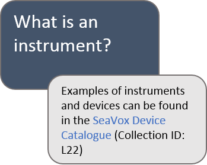
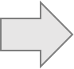
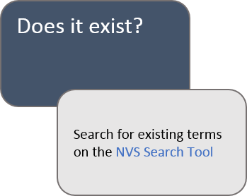
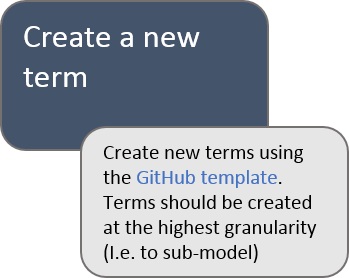

# L22
SeaVoX Device Catalogue - a controlled vocabulary containing names and descriptions of instruments and sensors used in the oceanographic and related domains. 

Terms and mappings available from:

* [NERC Vocabulary Server](http://vocab.nerc.ac.uk/collection/L22/current/)

* [BODC search interface](https://www.bodc.ac.uk/resources/vocabularies/vocabulary_search/L22/)

* [SeaDataNet search interface](http://seadatanet.maris2.nl/v_bodc_vocab_v2/search.asp?lib=L22)

* [SeaDataNet Device Thesaurus](http://vocab.nerc.ac.uk/scheme/SDNDEV/current/) to find instruments and sensors using a 3-level hierarchy made of the SeaDataNet Device Category Types (L21) at the top, SeaDataNet Device Categories (L05) and the SeaVoX Device Catalogue (L22). 

## Path to requesting a new term

<table border = "0">
  <tr>
    <td>
      
    </td>
    <td>
      
    </td>
        <td>
   
    </td>
     <td>
      
    </td>
      <td>
        
    </td>
  </tr>
  </table>

## Other ways to contribute
- Requests for new L22 concepts can be emailed to vocab.services@bodc.ac.uk if you do not have access to github)

- Reporting errors or suggestions for improving content can also be submitted as issues in this repository or emailed to vocab.services@bodc.ac.uk. 
